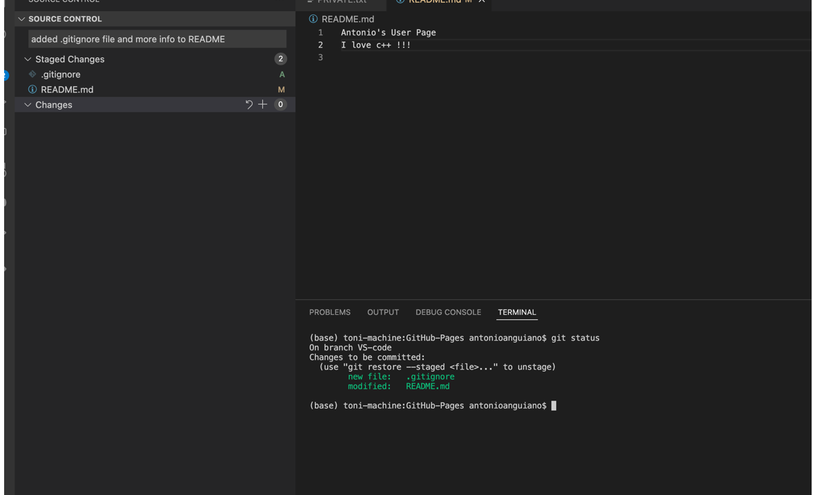

# **Antonio's User Page**
> *"Do not use semicolons. They are transvestite hermaphrodites, representing nothing. All they do is show you've been to college."* - Kurt Vonnegut [source](https://litreactor.com/columns/foonotes-kurt-vonnegut-and-the-semicolon)
> 

Clearly Vonnegut did not code in C! But I do. Hello, my name is Antonio, and for the most part I'm just a normal guy. Aside from programming, I like to study history, english literature, and music! As a programmer my interests currently lie in web development. But I'm still learning!
```
//for each loop example
for(int x : nums) {
    printf(x)
}
```
## programming anguages I at least sort of know
- C
- C++
- python
- java
- javascript
## if I had to rank my skill in each language:
1. c++
2. python
3. c
4. java
5. javascript

### morning todo list
- [x] wake up!
- [x] make coffee
- [] gym
- [] start my day!

woah a random screenshot!


you can find it on my [README.md](README.md)
